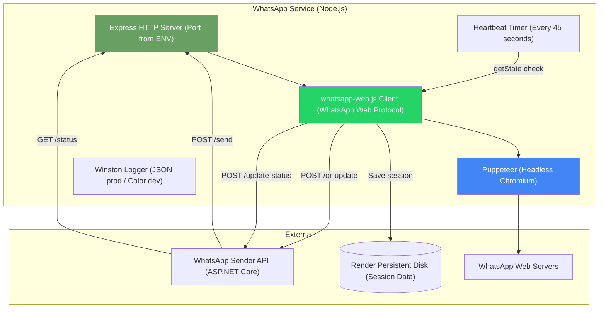
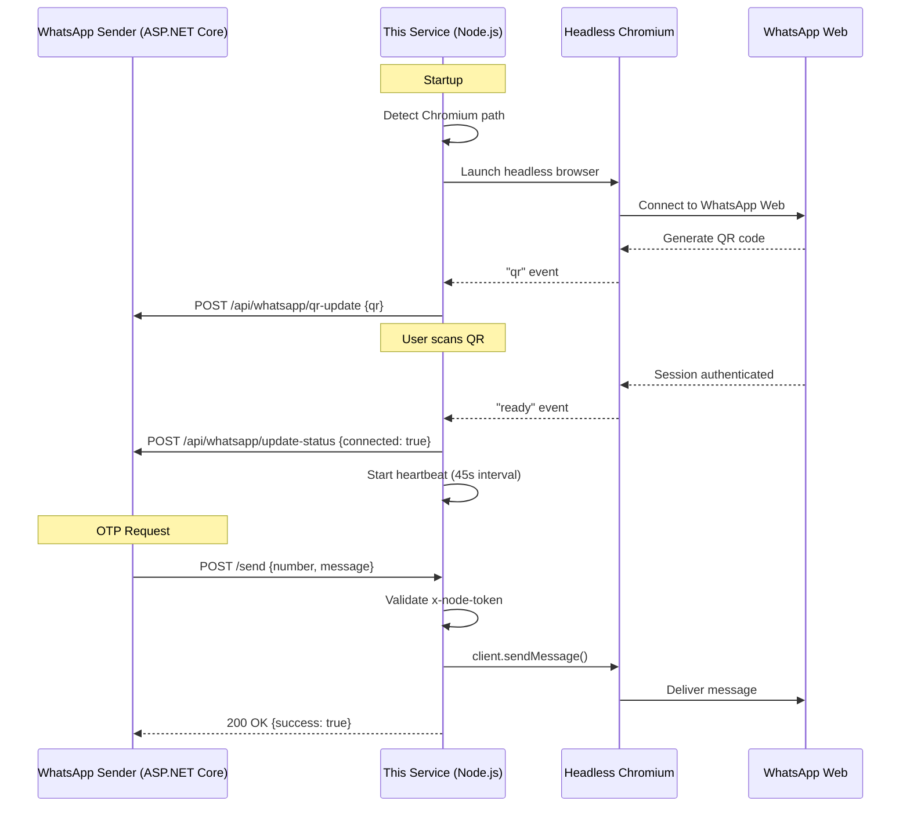
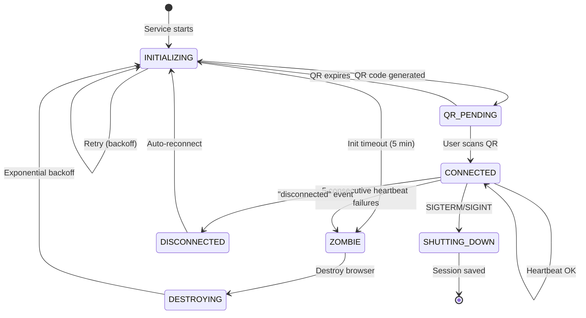
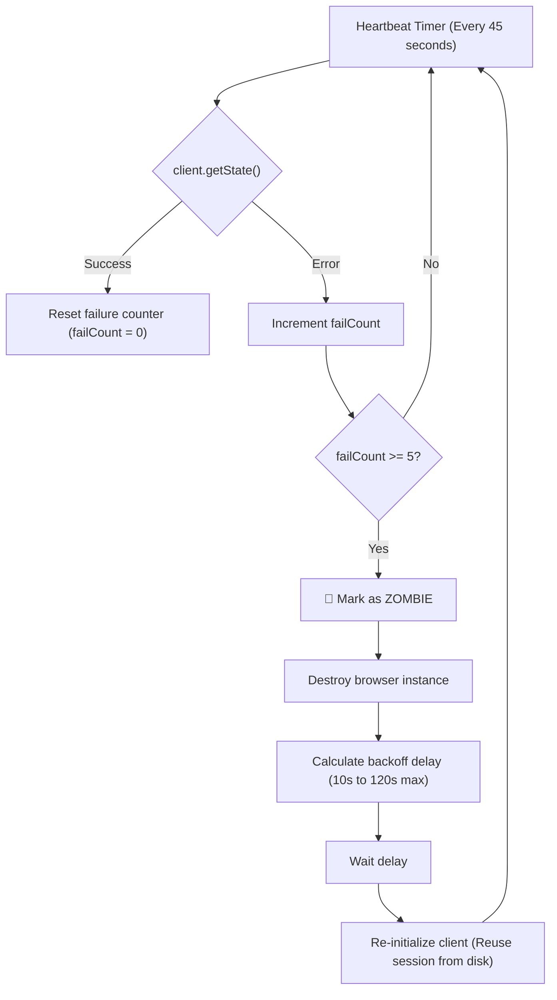
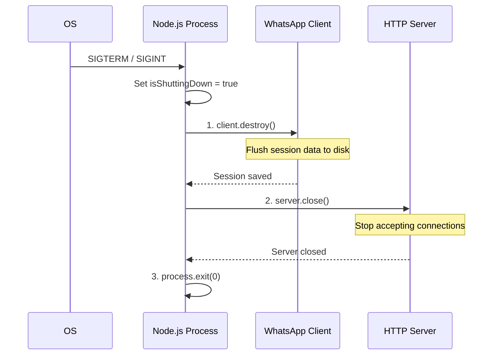
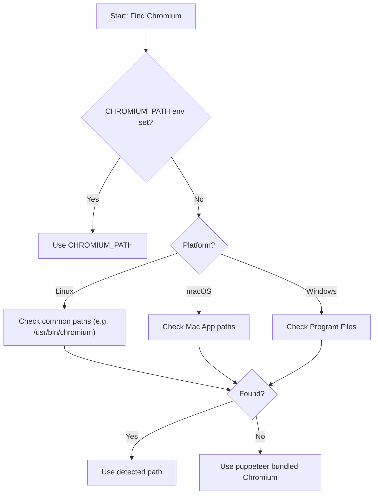

# WhatsApp Service — Node.js Messaging Engine

> A self-healing WhatsApp Web automation service using Puppeteer + whatsapp-web.js, designed for production deployment on Render with persistent sessions.

This service is the **engine** of Wasla's WhatsApp messaging pipeline. It manages a headless Chromium browser that automates WhatsApp Web, handling message delivery, QR code generation, session persistence, and automatic recovery from browser crashes.

---

## Table of Contents

- [Architecture](#architecture)
- [How It Works](#how-it-works)
- [State Machine](#state-machine)
- [Zombie Detection & Self-Healing](#zombie-detection--self-healing)
- [Graceful Shutdown](#graceful-shutdown)
- [API Endpoints](#api-endpoints)
- [Configuration](#configuration)
- [Chromium Auto-Detection](#chromium-auto-detection)
- [Docker Deployment](#docker-deployment)
- [Project Structure](#project-structure)

---

## Architecture



### Communication Flow



---

## How It Works

1. **Startup**: The service detects the Chromium binary path (cross-platform auto-detection), launches a headless browser via Puppeteer, and initializes the whatsapp-web.js client.

2. **QR Generation**: WhatsApp Web generates a QR code. The service pushes it to the Sender API via `POST /api/whatsapp/qr-update`, which caches it and broadcasts to the Angular dashboard via SignalR.

3. **Authentication**: An admin scans the QR code with their phone. The service receives the `ready` event and notifies the Sender API that the connection is active.

4. **Message Delivery**: When an OTP is needed, the Sender API calls `POST /send` with the phone number and message. The service validates the `x-node-token` header and uses the whatsapp-web.js client to deliver the message.

5. **Session Persistence**: Session data is saved to disk (`SESSION_DATA_PATH`) so that restarts don't require a new QR scan.

---

## State Machine



---

## Zombie Detection & Self-Healing



**Why this exists**: Puppeteer's Chromium can crash (OOM, detached frame, protocol errors) while the Node.js process stays alive. Without zombie detection, the service would appear healthy but be unable to send messages.

**Key parameters**:
- Heartbeat interval: **45 seconds**
- Failure threshold: **5 consecutive failures**
- Backoff: **10s → 20s → 40s → 80s → 120s (max)**
- Grace period after READY: **60 seconds** (prevents restart loops)
- Init hard timeout: **5 minutes**

---

## Graceful Shutdown



**Order matters**: If the HTTP server closes first, the hosting platform (Render) may kill the process before the WhatsApp session saves — forcing a new QR scan on restart.

---

## API Endpoints

| Method | Path | Auth | Description |
|:--|:--|:--|:--|
| POST | `/send` | x-node-token | Send a WhatsApp message |
| GET | `/status` | x-node-token | Get connection status & state |
| POST | `/health` | x-node-token | Trigger zombie detection check |

### POST `/send`

```json
// Request
{ "number": "201234567890", "message": "Your OTP: 123456" }

// Response (success)
{ "success": true, "message": "Message sent successfully" }

// Response (not ready)
{ "success": false, "error": "WhatsApp client is not ready" }
```

---

## Configuration

| Env Variable | Required | Description |
|:--|:--|:--|
| `PORT` | No | HTTP server port (default: 3000) |
| `ASP_NET_BASE_URL` | Yes | WhatsApp Sender API base URL |
| `NODE_TOKEN` | Yes | Shared secret for M2M auth |
| `SESSION_DATA_PATH` | No | Path to persist WhatsApp session |
| `CHROMIUM_PATH` | No | Manual Chromium binary path |
| `NODE_ENV` | No | `production` or `development` |
| `LOG_LEVEL` | No | Winston log level (default: `info`) |

---

## Chromium Auto-Detection



---

## Docker Deployment

```dockerfile
FROM node:18-slim
# Install Chromium dependencies
RUN apt-get update && apt-get install -y chromium ...
WORKDIR /app
COPY package*.json ./
RUN npm ci --omit=dev
COPY . .
ENV PUPPETEER_SKIP_CHROMIUM_DOWNLOAD=true
CMD ["node", "--max-old-space-size=512", "index.js"]
```

### Render Deployment

The service deploys on Render with a **1GB persistent disk** mounted at the session data path. The `render.yaml` blueprint and `render-build.sh` handle Chromium installation.

---

## Error Handling

Known transient Puppeteer errors are caught and suppressed at the process level:

| Error Pattern | Action |
|:--|:--|
| `"Target closed"` | Suppress, trigger soft reconnect |
| `"Session closed"` | Suppress, trigger soft reconnect |
| `"detached Frame"` | Suppress, ignore |
| `"Protocol error"` | Suppress, trigger reconnect |
| All others | Log and let zombie detection handle |

These are caught at both `process.on('unhandledRejection')` and `process.on('uncaughtException')` levels.

---

## Project Structure

```
whatsapp-service/
├── index.js              # Entry point: server, shutdown, error handling
├── src/
│   ├── config/
│   │   └── index.js      # Chromium detection, env vars, Puppeteer args
│   ├── routes/
│   │   └── index.js      # Express routes: /send, /status, /health
│   ├── services/
│   │   └── whatsappClient.js  # State machine, zombie detection, reconnect
│   ├── middleware/
│   │   └── auth.js       # x-node-token validation middleware
│   └── utils/
│       └── logger.js     # Winston logger (JSON prod, color dev)
├── Dockerfile
├── render.yaml           # Render deployment blueprint
├── render-build.sh       # Chromium install script for Render
└── package.json
```

---

## Logging

Uses **Winston** with dual formats:

- **Production**: JSON structured logs with timestamps, PID, service name
- **Development**: Colorized console output with stack traces

```javascript
// Production output
{"level":"info","message":"WhatsApp client ready","service":"whatsapp-service","pid":1234,"timestamp":"2024-01-01 12:00:00"}

// Development output
12:00:00 info: WhatsApp client ready
```

